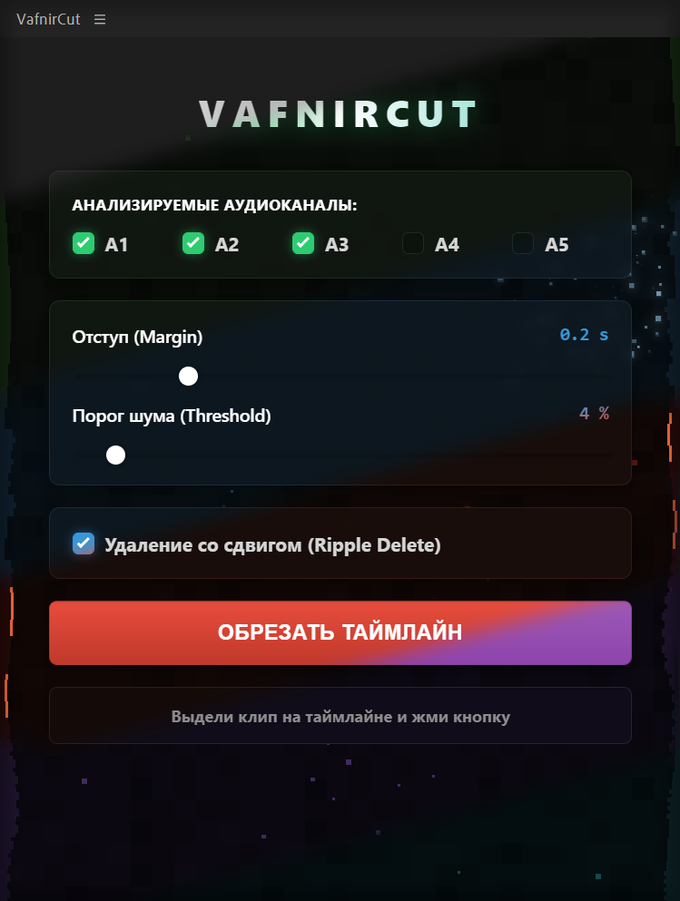

**English** | [Русский](README.ru.md)

# ✂️ VafnirCut — Automated Silence Cutter for Premiere Pro

  <h1>✂️ VafnirCut — Automated Silence Cutter</h1>
  
  
  
  
<em>A stylish multi-channel auto-editor with 6 custom themes</em>

**VafnirCut** is a free and "stylish" plugin for Adobe Premiere Pro that automatically cuts out silence and heavy breaths from your video and audio tracks using neural networks (powered by [auto-editor](https://github.com/WyattBlue/auto-editor)).

No more spending hours on rough cuts — the plugin does it for you in one click!

## ✨ Key Features

* 🎙️ **Multi-channel analysis:** Select any audio tracks (A1-A5) to detect silence.
* 🎛️ **Fine-tuning:** Sliders for Margin and Threshold.
* 🎨 **Custom Design:** 6 cool themes (Forest, Ice, Lava, Clouds, Water, Earth) with interactive geysers and 1 strict (Pro) theme for minimalists.
* ⚡ **Full Automation:** The installer will automatically download the required version of Python and configure the neural network for you.

## 📥 How to Install (Windows)

1. Go to the **[Releases](https://github.com/MrVAFNIR/PremierePro-silence-cutter-VafnirCut/releases/latest)** section on the right side of this page and download `VafnirCut_Installer.exe`.
2. Run the file **as Administrator**.

> **⚠️ IMPORTANT:** Since the installer automatically configures Adobe system folders and silently installs Python, *Windows Defender or your antivirus may show a warning*. This is totally normal! Click **"More info" -> "Run anyway"**. The source code is open and available in this repository.

3. Wait for the black installation window to close.
4. Restart Premiere Pro.
5. If Python was installed on your system for the first time, a PC reboot is recommended.

## 🚀 How to Use

1. Open Premiere Pro.
2. In the top menu, navigate to: `Window` -> `Extensions` -> `VafnirCut`.
3. **Select the clip** on the timeline that you want to process.
4. Adjust the threshold and select the tracks to analyze in the plugin (default settings are usually good to go).
5. Click **"ОБРЕЗАТЬ ТАЙМЛАЙН"** (CUT TIMELINE).
6. Done! The new edited sequence will appear in the `CUT` folder in your project panel.

## ☕ Support the Author

If this plugin saved you hours of tedious work and preserved your nerves, you can say thanks and support future updates! Any support is highly motivating:

💳 **[Support the project on DonationAlerts](https://www.donationalerts.com/r/vafnir)**

## 🛠️ Compatibility

* Adobe Premiere Pro CC 2020 and newer.
* Windows 10 / Windows 11.

---

*Made with soul for editors, by an editor.*
